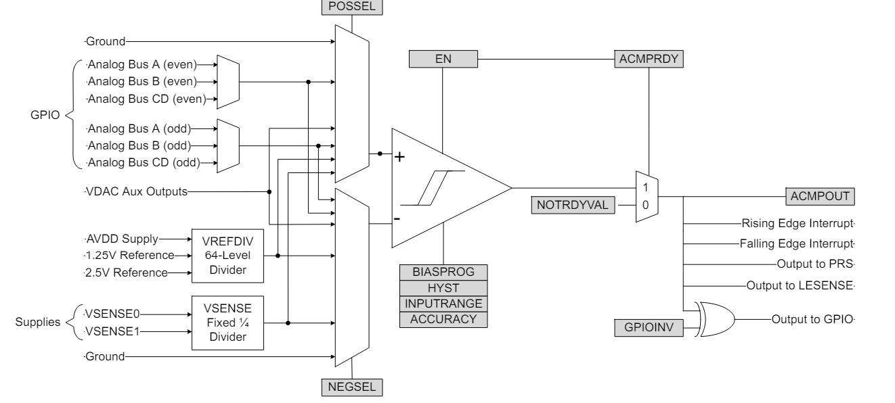

# ACMP

Quoi ?

L'ACMP (Analog Comparator) compare deux signaux analogiques et renvoie une valeur numérique indiquant lequel est
plus grand.

Pourquoi ?

Les applications n’ont souvent pas besoin de connaître le nombre exact
valeur d'un signal analogique, uniquement s'il a dépassé un certain seuil. Souvent, la tension doit être surveillée
en continu, ce qui nécessite une puissance extrêmement faible
consommation.

Comment ?

Disponible jusqu'au mode énergétique 3, l'ACMP peut
réveiller le système lorsque les signaux d'entrée passent le
seuil. Le comparateur analogique peut comparer deux
signaux analogiques ou un signal analogique et un hautement
référence interne configurable.

## Introduction

Le comparateur analogique compare la tension de deux entrées analogiques et émet un signal numérique indiquant quelle tension d'entrée est la plus élevée.
Les entrées peuvent provenir de références internes ou de broches externes. Le temps de réponse, et donc la consommation de courant, peut être configuré en modifiant l'alimentation en courant du comparateur.

## Caractéristiques

• Internal and external input selections:
  • External port I/O routed via ABUS
  • Internal 1.25 V bandgap reference voltage with programmable divider
  • Internal 2.5 V bandgap reference voltage with programmable divider
  • AVDD supply voltage with programmable divider
  • VDAC auxiliary outputs
• Voltage supply monitoring
• Configurable hysteresis
• Selectable response time
• Operational in EM0 to EM3
• Asynchronous interrupt generation on selectable edges
• Configurable output state when inactive
• Output routing options:
  • Route to GPIO via DBUS
  • Route to most peripherals via PRS
• Available to LESENSE logic

## Description Fonctionnel

Le comparateur dispose de deux entrées analogiques : une positive et une négative. Lorsque le comparateur est actif, la sortie indique lequel des
deux tensions d'entrée sont plus élevées. Lorsque la tension sur l'entrée positive est supérieure à la tension sur l'entrée négative, la sortie numérique est
mise à 1 et vice versa.
En plus du cœur du comparateur, le frontal ACMP comprend des sources de référence, des circuits diviseurs de tension et des multiplexeurs d'entrée pour acheminer
signaux aux entrées positives et négatives. La sortie de l'ACMP est disponible sur PRS et GPIO, en plus d'être observable dans le registre ACMP_STATUS.

## Configuration et contrôle

L'ACMP est configuré et contrôlé via trois registres : `ACMP_CFG`, `ACMP_CTRL` et `ACMP_INPUTCTRL`. 
Configuration via `ACMP_CFG` doit se produire avant que l'ACMP ne soit activé. 

Les registres de contrôle `ACMP_CTRL` et `ACMP_INPUTCTRL` peuvent ne sera mis à jour qu’après l’activation de l’ACMP. L'ACMP est activé en définissant le bit EN dans ACMP_EN. Si `ACMP_CFG` est mis à jour lorsque EN = 1, ou `ACMP_CTRL` / `ACMP_INPUTCTRL` est mis à jour tandis que EN = 0, un défaut bus est émis.

Les multiplexeurs d'entrée sont configurés dans les champs de bits `POSSEL`/`NEGSEL` dans `ACMP_INPUTCTRL`. Toutes les références et entrées sont disponibles dans les modes définis pour ces deux registres. Le bit `INPUTCTRL` dans `ACMP_SYNCBUSY` doit être vérifié avant d'écrire dans `ACMP_INPUTCTRL`. Si le bit `ACMP_SYNCBUSY_INPUTCTRL` est à 1, cela signifie qu'une précédente écriture dans le registre `ACMP_INPUTCTRL` est en attente, et le logiciel doit attendre que le bit `ACMP_SYNCBUSY_INPUTCTRL` indique 0.

Les multiplexeurs `POSSEL` et `NEGSEL` partagent plusieurs ressources sur l'appareil, telles que les circuits diviseurs `VREDIV` et `VSENSE`. Ainsi,
il y a quelques contraintes sur les configurations POSSEL/NEGSEL :
- `POSSEL` et `NEGSEL` ne peuvent pas sélectionner simultanément une broche GPIO paire.
- `POSSEL` et `NEGSEL` ne peuvent pas sélectionner simultanément une broche GPIO impaire.
- `POSSE` et `NEGSEL` ne peuvent pas sélectionner tous deux une tension d'alimentation via l'une des entrées `VSENSE`.
- `POSSEL` et `NEGSEL` ne peuvent pas tous deux sélectionner une entrée à l'aide de `VREFDIV`.
- Si `POSSEL` = `EXTPx`, une référence de faible puissance (postfixée par LP) ne peut pas être sélectionnée pour `NEGSEL`.

Si l'une de ces contraintes est violée, l'indicateur d'état `INPUTCONFLICT` et l'indicateur d'interruption INPUTCONFLICTIF seront activés.

L'ACMP utilise également des ressources de bus analogiques partagées au niveau de la puce pour se connecter aux broches GPIO externes. Le bus utilisé par l'ACMP dépend
sur la configuration de `POSSEL` et `NEGSEL`. Pour permettre à l'ACMP de contrôler un bus analogique, le bus doit être alloué à l'ACMP dans le
Module GPIO, utilisant les registres `GPIO_xBUSALLOC`. Par exemple, la broche PB5 est une broche impaire sur le port PB et pourrait se connecter
via le bus analogique `BODD0` ou `BODD1`. Ceci est configuré à l'aide du champ `BODD0` ou `BODD1` dans `GPIO_BBUSALLOC`.

Si le périphérique ACMP tente d'accéder à un bus qui n'a pas été alloué à cette instance d'ACMP, l'indicateur d'état `PORTALLOCERR`
et l'indicateur d'interruption `PORTALLOCERRIF` sera activé.